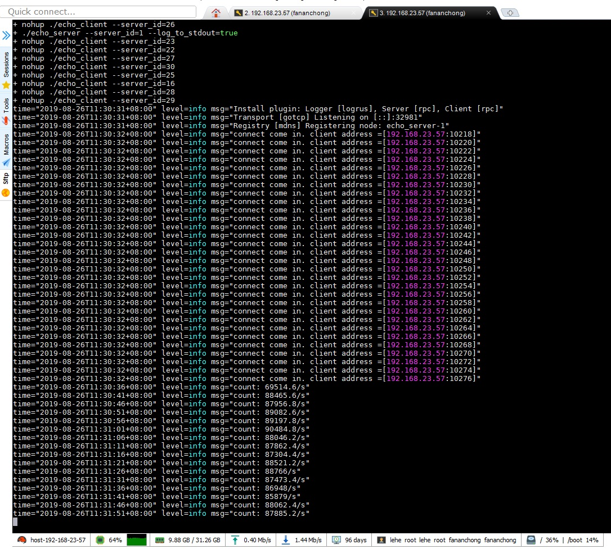
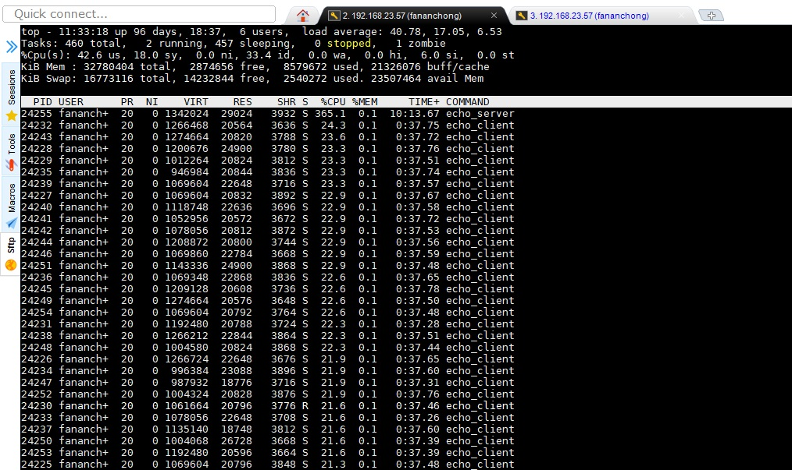
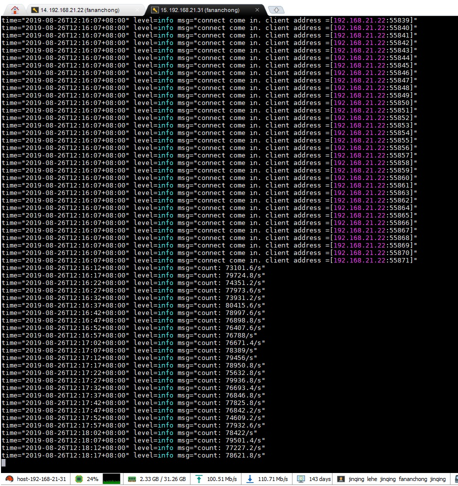
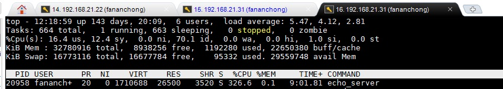
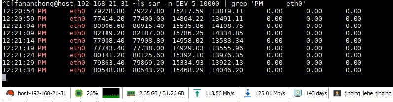
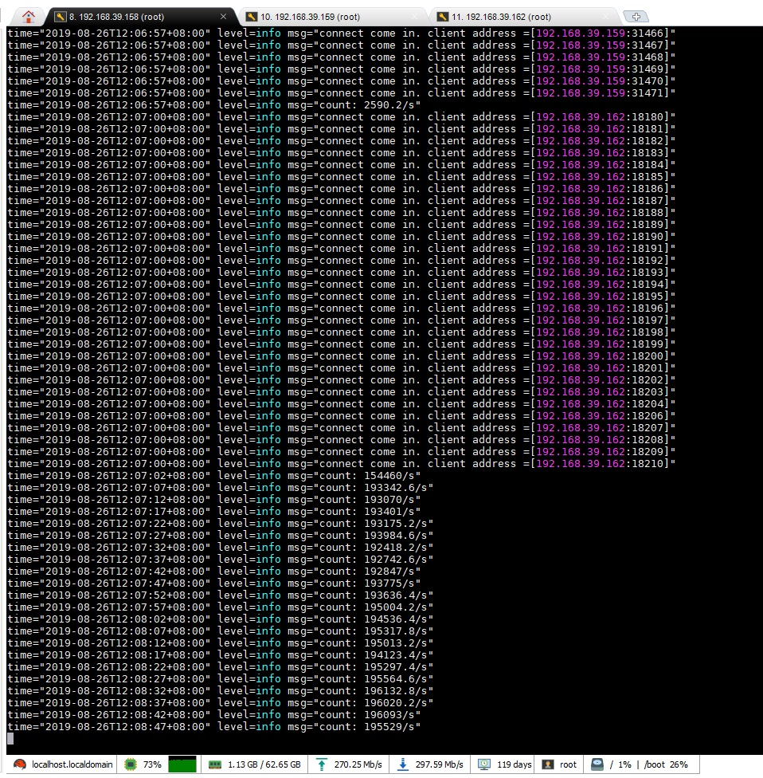
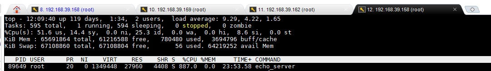
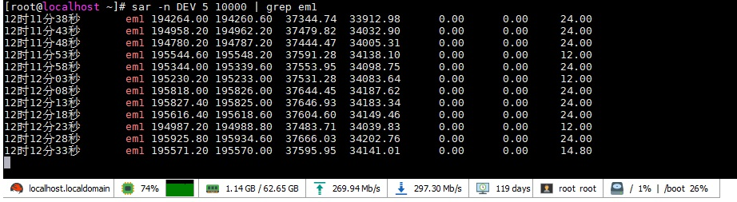

## 回显测试

##### 一、同一主机

- 机器配置： CPU 16核 ； 主频 2600
- 进程数： 1 服务器 ； 30 客户端
- 整机 CPU 65%
- 服务器程序 CPU 占 22.8% （ 365.1 / 1600 ）
- 8.7w qps
- 该主机为云机

##### 二、同局域网内，多台云机

- 机器配置： CPU 16核 ； 主频 2600
- 进程数： 1 服务器 （1 台云机）； 60 客户端 （1 台云机）
- 服务器程序 CPU 占 20.4%
- 7.8w qps

##### 三、同局域网内，多台物理机

- 机器配置： CPU 12核 ； 主频 1200 - 1700 （每个核都不一样， 命令 cat /proc/cpuinfo ）
- CPU 型号： Intel® Xeon® CPU E5-2603 v4 @ 1.70GHz
- 网卡： 10 Gb/s
- 进程数： 1 服务器 （1 台物理机）； 60 客户端 （2 台物理机，各 30 个客户端）
- 服务器程序 CPU 占 73.9%
- 19.5w qps

## 基准测试比较

以下测试环境均为一样

库        | 同一主机                 | 同局域网内，多台云机       | 同局域网内，多台物理机   | 测试代码地址
:---------|:-------------------------|:---------------------------|:-------------------------|:----------------
v-micro   | 8.7w qps   22.8% cpu  | 7.8w qps   20.4% cpu    | 19.5w qps   73.9% cpu | [echo](.)
go-micro  | 4w qps   29.8% cpu    | 5.9w qps   49.3% cpu    | 7.7w qps   85.3% cpu  | https://github.com/fananchong/test_go-micro_qps
gotcp     | 23w qps   25.5% cpu   | 11w qps   12% cpu       | 50w qps   82% cpu     | https://github.com/fananchong/gotcp
